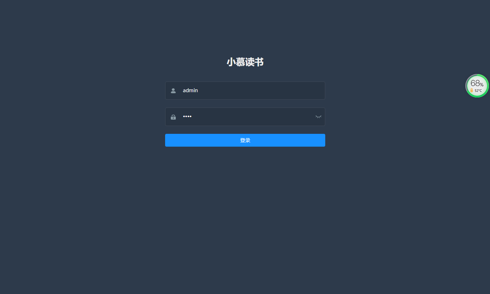
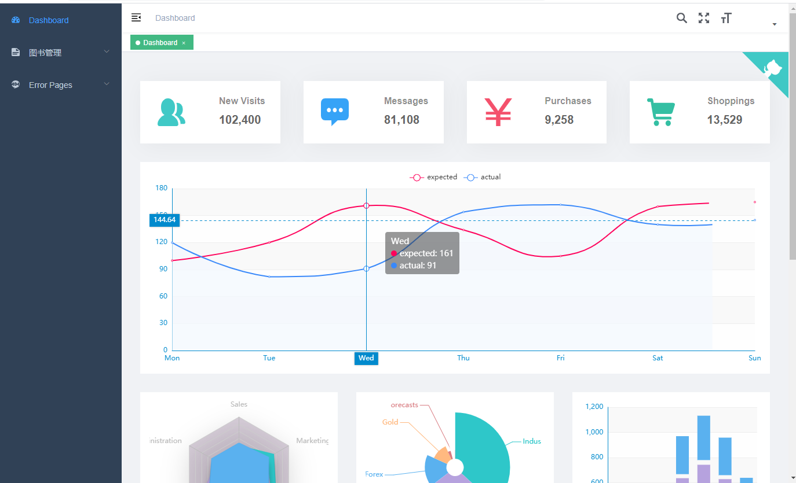
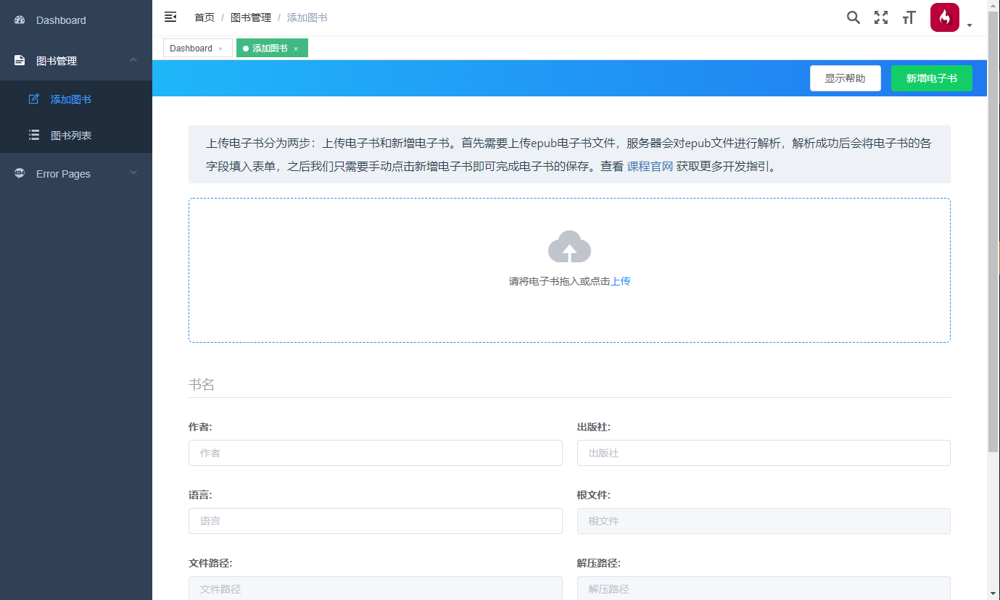
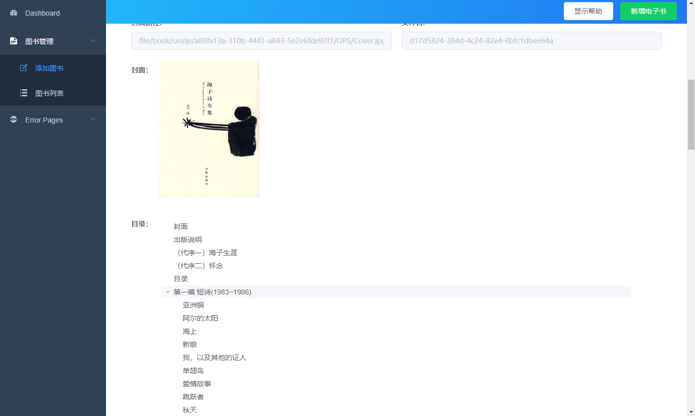
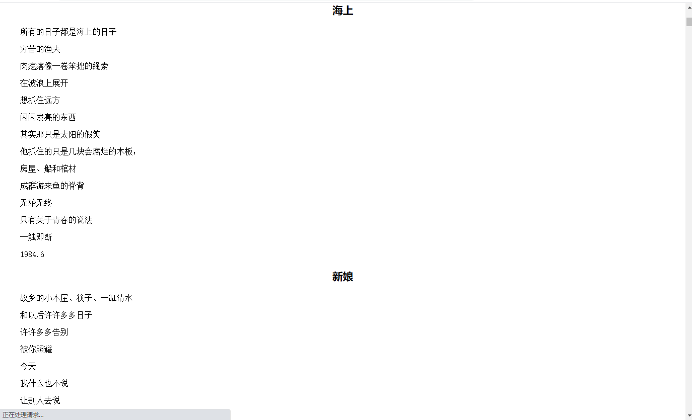
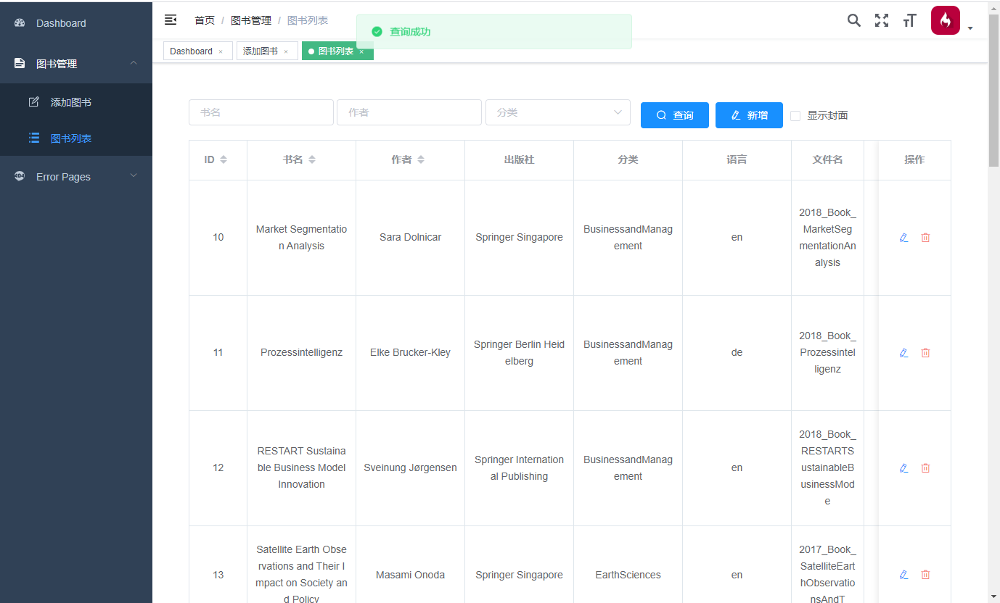

# book-SpringBoot

<p>


  <a href="https://gitee.com/simows/book-springBoot"></a>


## 项目介绍

`book-SpringBoot`小慕读书后台管理系统，完成EPUB电子书解析、基于角色的权限管理、jwtToken验证。 对于学习springBoot、springSecurity、jwt、电子书解析很有帮助

### 项目演示

#### 登录

地址：http://localhost:8082/index.html#/login

测试管理员账号

**用户名** admin **密码** 1111



#### 欢迎页面

地址：http://localhost:8082/index.html#/dashboard




### 图书管理

##### 添加图书  

##### 	地址：http://localhost:8082/index.html#/dashboard




##### 解析电子书

​	**地址** http://localhost:8082/index.html#/book/create




##### 点击任何一个目录即可预览




##### 查询电子书

​	**地址** http://localhost:8082/index.html#/book/list



### 
## 技术栈

> 1. Spring Boot
> 2. Vue

## 快速启动

1. 配置最小开发环境：
    * [MySQL](https://dev.mysql.com/downloads/mysql/)
    * [JDK1.8或以上](http://www.oracle.com/technetwork/java/javase/overview/index.html)
    * [Maven](https://maven.apache.org/download.cgi)
    
2. 数据库依次导入db/simobook.sql下的数据库文件

3. 修改数据库配置

    ```bash
    #数据库配置
    spring.datasource.url=jdbc:mysql://localhost:3306/simobook?useSSL=false&serverTimezone=UTC&characterEncoding=UTF8
    # 你的账号
    spring.datasource.username=root  
    # 你的密码
    spring.datasource.password=admin
    ```
    
4. IDEA 运行项目

    
    
    此时，浏览器打开，输入网址`http://localhost:8082/index.html`, 此时进入管理后台登录页面。
    
    
    
## 本项目基于或参考以下项目：

1. [vue-element-admin](https://github.com/PanJiaChen/vue-element-admin)
  
   项目介绍： 一个基于Vue和Element的后台集成方案
  
   项目参考：litemall项目的litemall-admin模块的前端框架基于vue-element-admin项目修改扩展。


## License

[MIT](https://github.com/linlinjava/litemall/blob/master/LICENSE)
Copyright (c) 2020-present linlinjava