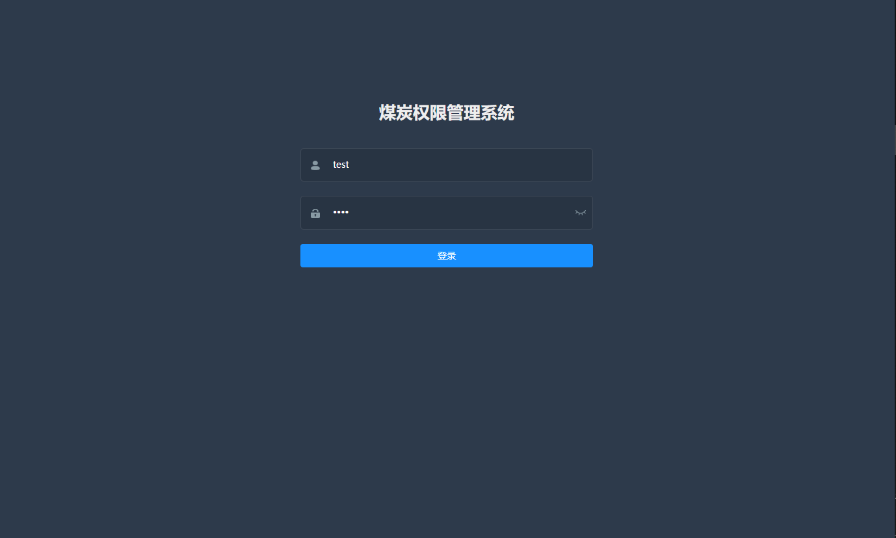
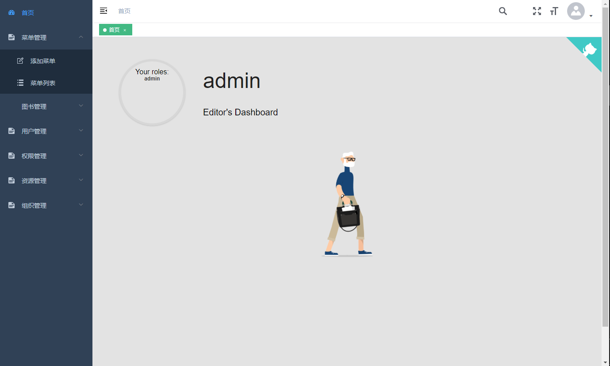
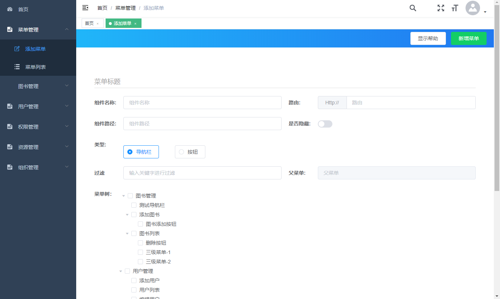
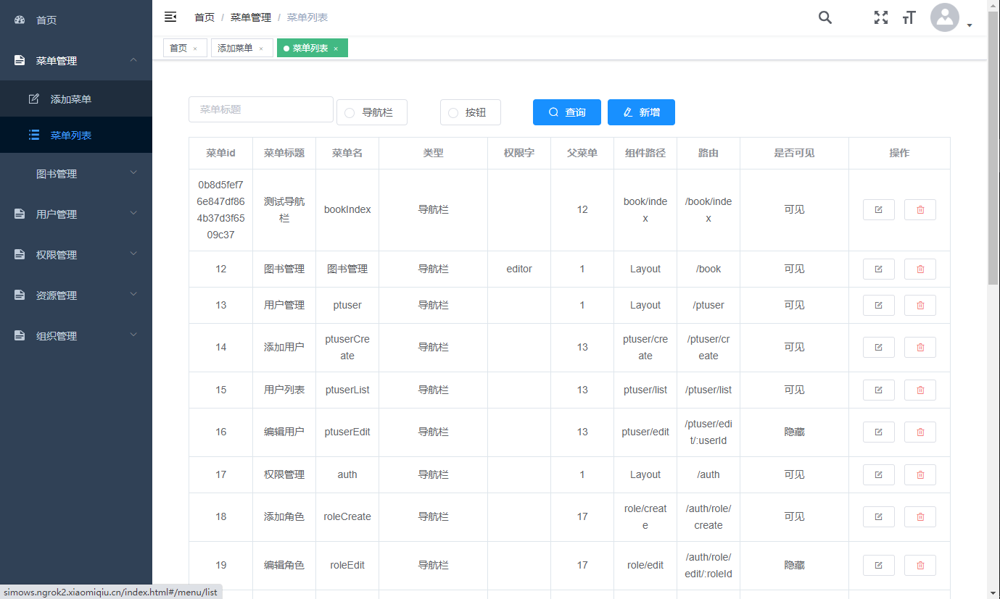
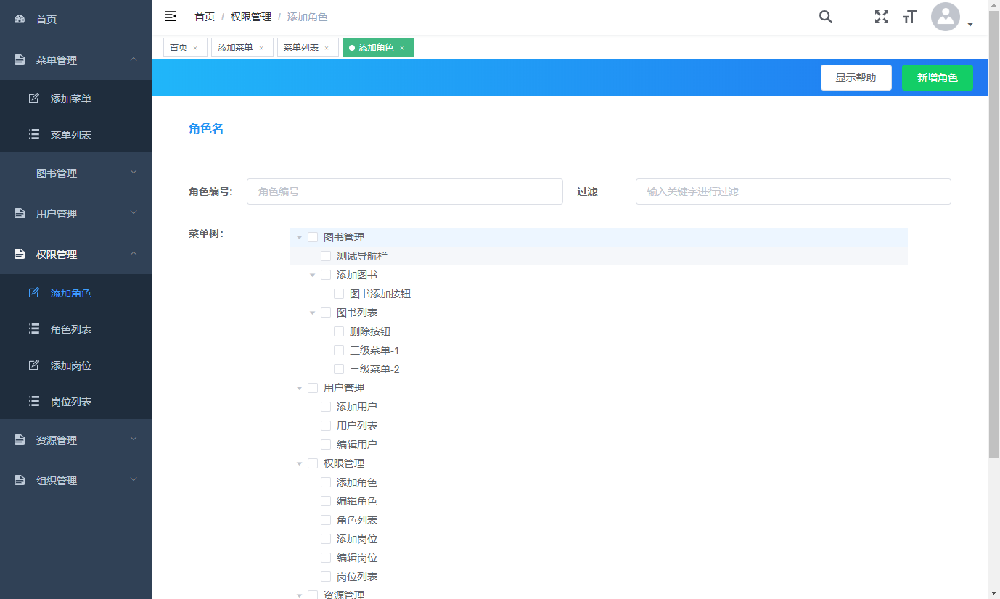
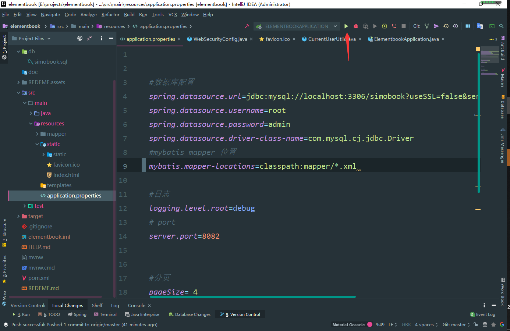

# authorityManagementSystem


  <a href="https://gitee.com/simows/authorityManagementSystem.git">
  </a>

## 项目介绍

`authorityManagementSystem`权限管理系统，基于  **组织 岗位  用户 角色 菜单**的五表权限管理、jwtToken验证、根据角色前端动态渲染路由、按钮级细粒度权限管理。 对于学习springBoot、springSecurity、jwt、vue、vue-admin很有帮助

### [在线文档](https://wsws1.github.io/)

### 项目演示

#### 登录

地址：http://localhost:8082/index.html#/login

测试账号

管理员： **用户名** admin **密码** 1111
普通用户：**用户名** test **密码** 1111


#### 欢迎页面

地址：http://localhost:8082/index.html#/dashboard




### 菜单管理管理

##### 添加图书  

##### 	地址：http://localhost:8082/index.html#/menu/create




##### 菜单列表

​	**地址** http://localhost:8082/index.html#/menu/list




#### 权限管理

##### 添加角色




## 技术栈

> 1. Spring Boot
> 2. Vue

## 快速启动

1. 配置最小开发环境：
    * [MySQL](https://dev.mysql.com/downloads/mysql/)
    * [JDK1.8或以上](http://www.oracle.com/technetwork/java/javase/overview/index.html)
    * [Maven](https://maven.apache.org/download.cgi)
    
2. 数据库导入db/auth.sql下的数据库文件

3. 修改数据库配置

    ```bash
    #数据库配置
    spring.datasource.url=jdbc:mysql://localhost:3306/auth?useSSL=false&serverTimezone=UTC&characterEncoding=UTF8
    # 你的账号
    spring.datasource.username=root  
    # 你的密码
    spring.datasource.password=admin
    ```
    
4. IDEA 运行项目

    
    
    此时，浏览器打开，输入网址`http://localhost:8082/index.html`, 此时进入管理后台登录页面。
    
    
    
## 本项目基于或参考以下项目：

1. [vue-element-admin](https://github.com/PanJiaChen/vue-element-admin)
  
   项目介绍： 一个基于Vue和Element的后台集成方案

2. [el-admin](https://github.com/elunez/eladmin-web)
  
   项目介绍： 一个基于 Spring Boot 2.1.0 、 Spring Boot Jpa、 JWT、Spring Security、Redis、Vue的前后端分离的后台管理系统

## License

[MIT](https://github.com/linlinjava/litemall/blob/master/LICENSE)
Copyright (c) 2020-present 